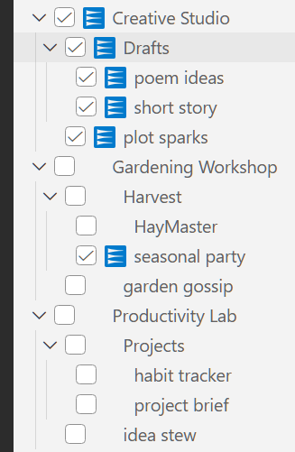

# Instruction Files Switcher

## Your One-Click Stop to Managing Instruction Files

Do you ever feel like VS Code buried the instruction files in a hidden drawer just because it could? This extension is the friendly reminder that yes, those `.instructions.md` files still matter — and yes, you should still be able to manage them without spelunking through menus.

**It works right out of the box.** Install it, click the **IFS** icon in the Activity Bar, and every instruction file VS Code already knows about is sitting there waiting to be toggled. No setup. No folder reshuffling. No migration step.

Want to organise things into subfolders? Go ahead — IFS will happily show the nesting. Don't want to? Also fine — IFS shows whatever is already on disk. The choice is yours, not the extension's.

No more digging through the file explorer. No more “where did that instruction file go?” moments. Just a simple, visual way to manage your instructions without leaving the editor.

### What it does

- Adds a tiny, cheerful Activity Bar view called **IFS**
- Shows your instruction files in a tree view — folders and all
- Lets you toggle them on and off with one click
- Auto-detects the instruction folders VS Code already knows about (Stable, Insiders, the secret prompts folder, your workspace `.github/instructions`, …)
- Gives you up to ten independent tree views, so each scope stays in its own lane
- Remembers named **profiles** so you can flip between *“Writing mode”*, *“Refactoring mode”*, or *“On vacation, please leave a message”* in one click

### The trick behind the curtain

There is no magic. There is no daemon. There is no folder-shuffling.

VS Code only treats a file as an instruction file if its name ends in `.instructions.md`. Anything else — even something like `my_notes.instructions.IFS_DEACTIVATED.md` — is politely ignored.

IFS uses exactly that fact:

- **Checked** → the file ends in `.instructions.md`. VS Code reads it.
- **Unchecked** → IFS renames the extension to `.instructions.IFS_DEACTIVATED.md`. VS Code looks the other way.

Your files never move. They stay exactly where you put them, in whatever folder structure makes you happy. Only the extension changes. That is the whole mental model.

### Why it exists

We all know the first rule of AI:

> Know thy context window.

So when the editor hides the files, the context vanishes too. This extension is the little helper that keeps your instructions visible and under control — without needing a secret handshake.

### Who should use it

- Developers who use `.instructions.md` files for project notes, guides, or build hints
- People who want to avoid accidental instruction-file drift
- Anyone annoyed by “magic missing files” in the workspace root
- Anyone who has ever stared at a chat reply and whispered *“why on earth did it think that?”*

### Not a feature, but a convenience

This is not a re-write of VS Code. It is not a conspiracy. It is a tiny, honest tool for one honest job:

- keep your instruction files visible
- keep them switchable
- keep them out of your way when you don’t want them



### An example folder structure

```
Your instruction files folder
├── Gardening Workshop
│   ├── garden gossip.instructions.md
│   └── Harvest
│       ├── HayMaster.instructions.md
│       └── seasonal party.instructions.md
├── Creative Studio
│   ├── plot sparks.instructions.md
│   └── Drafts
│       ├── short story.instructions.md
│       └── poem ideas.instructions.md
└── Productivity Lab
    ├── idea stew.instructions.md
    └── Projects
        ├── project brief.instructions.md
        └── habit tracker.instructions.md
```
<br clear="right" />

## Getting started

1. Install the extension. No reload required — IFS wakes up on its own.
2. On first launch, IFS sniffs around for known instruction folders:
   - **Found one?** It is silently adopted as your **User Path** and shown in the **IFS** Activity Bar view. You are done.
   - **Found several?** A Quick Pick titled **Select Primary USER PATH** appears. Pick the one you want as your primary; the rest become Workspace trees.
   - **Found none?** Nothing intrusive happens. The **IFS User** tree shows up empty, ready for you to point it somewhere via settings.
3. Click the **IFS** icon in the Activity Bar and start ticking boxes.

Where does IFS look? In this order:

1. The path you configured in `ifs.paths.user`.
2. The conventional VS Code prompt folders for your OS — Stable and Insiders, plus `~/.copilot/instructions`.
3. Workspace-level paths from VS Code's `chat.instructionsFilesLocations` setting.

## What lives in the sidebar

- **IFS User** — your personal instruction folder.
- **IFS Workspace 1..10** — one tree per additional auto-detected or manually configured path. Each is independent, so a workspace tree won't barge into your User tree's business.
- Empty slots show up as collapsed, unused trees. Configure them on the fly without diving into `settings.json`.

### Per-item actions (hover to reveal)

- **Open** — opens the instruction file in the editor.
- **Rename** — renames the file on disk, keeping the active or deactivated extension intact automatically.
- **Open Folder in Explorer** — reveals the folder in your OS file manager (on folders and the root).

### Toolbar actions (top of each tree)

- **Refresh** — re-scan the configured path and rebuild the tree.
- **Profiles** / **Workspace Profiles** — open the profile picker.
- **Open Config** — jump straight to the IFS section in VS Code Settings.
- **Reset…** — wipe IFS settings (User path, Workspace paths, profiles, …) with confirmation.

## Profiles

A profile is a named snapshot of *which files are currently checked*. Save one, switch to another, come back later — IFS will tick and untick the boxes for you.

Open the profile picker via the icon in the tree title bar. From there you can:

- Activate a saved profile.
- **Add Profile** — save the current tree state under a new name.
- Rename a profile (edit icon).
- Delete a profile (trash icon).

User profiles and Workspace profiles are stored separately, so a workspace's snapshot will not pollute your personal one.

## Configuration

IFS is configured through standard VS Code settings. Open them via:

- The **IFS: Open Config** command from the Command Palette.
- The **Open Config** entry in the `…` menu of any IFS tree view.
- Searching for `ifs` in VS Code Settings.

When IFS writes its own changes (User Path, profiles, additional paths, …) it always saves them to your **User (Global)** settings, so they follow you across every window and workspace. The settings are declared with `"scope": "application"`, so the VS Code Settings UI doesn't even show a Workspace tab for them — there's nothing to accidentally override per-workspace.

### Settings reference

| Setting | Type | Default | What it does |
|---|---|---|---|
| `ifs.paths.user` | string | empty | Absolute path to your primary instruction folder shown in **IFS User**. Prefer the **IFS: Set User Path** command over editing this by hand. |
| `ifs.paths.additional` | string[] | empty | Additional instruction folders, one per **IFS Workspace** tree. |
| `ifs.additionalPaths` | number (0–10) | 1 | How many *spare* empty workspace slots to show. The combined total of auto-detected + configured + spare paths is capped at ten. |
| `ifs.notifications.hideAll` | boolean | false | Silence info/warning popups. Errors and modal confirmations are always shown. |
| `ifs.logging.enabled` | boolean | false | Write log messages to the **IFS** Output channel (auto-revealed on errors). |
| `ifs.profiles.user` | profile[] | empty | Saved profiles for the **IFS User** tree. Normally managed via the Profiles Quick Pick. |
| `ifs.profiles.additional` | profile[] | empty | Saved profiles for the **IFS Workspace** trees. |

All seven settings are stored at the **User (Global)** scope.

### Resetting

If your settings get into a weird state, run **IFS: Reset…** from the Command Palette (or the `…` menu of any IFS tree). Pick what to wipe — just the User Path, just the additional paths, just the profiles, or the whole lot — and confirm. Reset clears the chosen keys at both User and Workspace scopes (defensive cleanup of any legacy or hand-edited workspace overrides).

## Cross-platform

IFS knows the conventional VS Code prompt-folder locations for Windows, macOS, and Linux, plus the Insiders variants on each. It also handles paths written with `~` (home directory) or relative to the workspace.

---

> Know thy context window. Then check a box.
